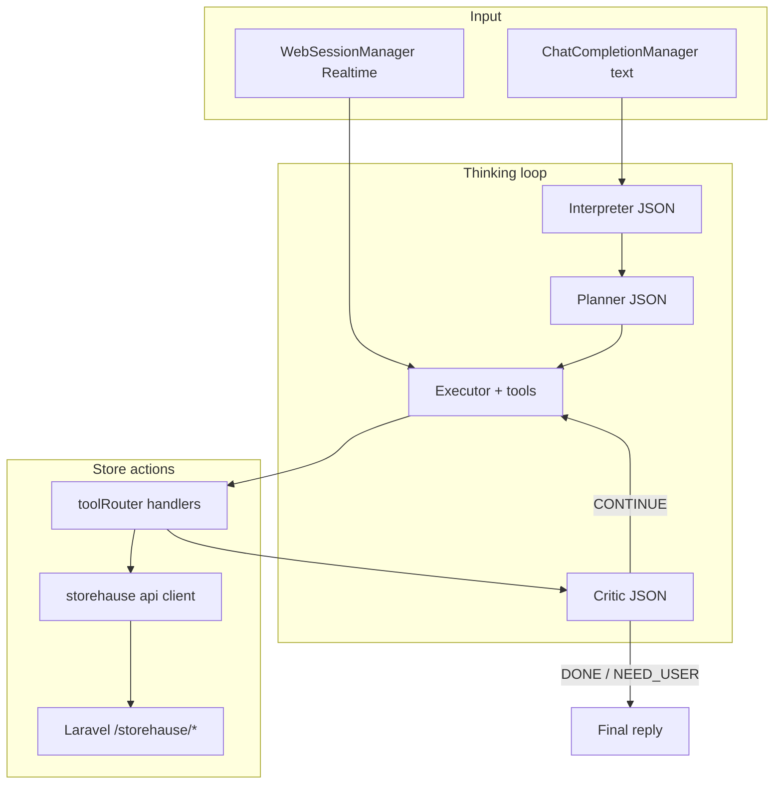

# Voice-Powered Store Assistant (PlanPal-style)

## Reference architecture

PlanPal's pattern ([`docs/AI_AGENT_THINKING_ARCHITECTURE.md`](/Users/reece/Documents/MohWork/plan-pal/docs/AI_AGENT_THINKING_ARCHITECTURE.md)) separates concerns cleanly:



**Port from PlanPal** (adapt, don't copy blindly):

| PlanPal file                                                                                                                                | StoreHause equivalent                                |
| ------------------------------------------------------------------------------------------------------------------------------------------- | ---------------------------------------------------- |
| [`src/voiceinfra/ChatCompletionManager.ts`](/Users/reece/Documents/MohWork/plan-pal/src/voiceinfra/ChatCompletionManager.ts)                | Same orchestration for text turns                    |
| [`src/voiceinfra/agentThinking.ts`](/Users/reece/Documents/MohWork/plan-pal/src/voiceinfra/agentThinking.ts)                                | Interpreter / Planner / Critic                       |
| [`src/voiceinfra/toolRouter.ts`](/Users/reece/Documents/MohWork/plan-pal/src/voiceinfra/toolRouter.ts)                                      | Store-specific tools only                            |
| [`src/voiceinfra/WebSessionManager.ts`](/Users/reece/Documents/MohWork/plan-pal/src/voiceinfra/WebSessionManager.ts) + `WebAudioManager.ts` | Realtime voice path                                  |
| [`app/api/chat/route.ts`](/Users/reece/Documents/MohWork/plan-pal/app/api/chat/route.ts)                                                    | OpenAI chat proxy in Next.js                         |
| [`src/components/commerce/ChatArea.tsx`](/Users/reece/Documents/MohWork/plan-pal/src/components/commerce/ChatArea.tsx)                      | Pattern for wiring manager + system prompt + context |

StoreHause product spec alignment: [`docs/AIStorefrontBuilderFlow.md`](/Users/reece/Documents/webprojects/Yraylabs/StoreHause/storehause/docs/AIStorefrontBuilderFlow.md) — AI should mutate **structured `StorefrontContent`**, not raw HTML.

## Current integration points (already exist)

- **Dashboard shell**: [`src/components/merchant-shell.tsx`](/Users/reece/Documents/webprojects/Yraylabs/StoreHause/storehause/src/components/merchant-shell.tsx) — mount global FAB here.
- **Auth-gated admin**: [`src/app/admin/layout.tsx`](/Users/reece/Documents/webprojects/Yraylabs/StoreHause/storehause/src/app/admin/layout.tsx).
- **API client** ([`src/lib/api/client.ts`](/Users/reece/Documents/webprojects/Yraylabs/StoreHause/storehause/src/lib/api/client.ts)):
  - `createStore`, `getMyStore`, `updateMyStore`
  - `generateStorefront`, `getStorefront`, `updateStorefront`
  - `getStorefrontTemplates`, `uploadStorefrontImage`
- **Products today**: managed via `updateStorefront` patching `storefront.products` ([`src/app/admin/products/page.tsx`](/Users/reece/Documents/webprojects/Yraylabs/StoreHause/storehause/src/app/admin/products/page.tsx)).
- **Backend realtime token**: Laravel already exposes `POST /api/open-token` ([`OpenTokenController.php`](/Users/reece/Documents/webprojects/Yraylabs/StoreHause/storehausebackend/app/Http/Controllers/OpenTokenController.php)) — reuse for WebRTC; pass merchant-specific `prompt` + `transcription_prompt`.
- **Gap vs doc**: builder session / NL edit endpoints in the doc are **not** implemented yet; backend `generateStorefront` uses rule-based `synthesizeStorefront()`. MVP will have the **LLM produce structured patches** client-side and persist via existing `PATCH /storehause/ai/storefront/{storeId}`.

## Proposed file layout (storehause)

```
src/voiceinfra/           # ported core (thinking loop, managers, types)
src/libs/store-assistant/
  storeAssistantToolDefs.ts
  storefrontPatch.ts      # merge partial content into StorefrontContent
  buildAssistantContext.ts
src/components/assistant/
  StoreAssistantProvider.tsx
  StoreAssistantFab.tsx
  StoreAssistantPanel.tsx
src/store/useStoreAssistantStore.ts
app/api/chat/route.ts     # text completions proxy (OPENAI_API_KEY server-side)
```

## Store assistant tools (MVP)

Define tools in `storeAssistantToolDefs.ts` and register via `toolRouter()`:

| Tool                       | Purpose                                                                                                          |
| -------------------------- | ---------------------------------------------------------------------------------------------------------------- |
| `store_create`             | Call `api.createStore` when merchant has no store                                                                |
| `store_update_settings`    | `api.updateMyStore` (brand color, etc.)                                                                          |
| `storefront_generate`      | `api.generateStorefront` (first draft / regen)                                                                   |
| `storefront_patch`         | Merge partial `StorefrontContent` paths (hero, about, faq, palette, template, pages) then `api.updateStorefront` |
| `storefront_set_template`  | Set `storefront_template_id` + optional palette                                                                  |
| `product_upsert`           | Add/update one product in `storefront.products`                                                                  |
| `product_remove`           | Remove by product `id`                                                                                           |
| `products_import_rows`     | Bulk add from parsed rows (voice-described catalog)                                                              |
| `assistant_show_templates` | Return template widgets in chat via `chat_add_ai_message`                                                        |
| `chat_add_ai_message`      | Rich assistant bubbles (template cards, confirmations)                                                           |

**Guardrails in tool handlers** (like PlanPal's price validation):

- Reject patches to unknown product ids.
- Require store ownership (implicit via auth token on `api`).
- Block empty `storefront_patch` that would wipe content.
- After mutations, invalidate React Query keys used by `/admin`, `/admin/website`, `/admin/products`.

## System prompt + live context

Build per-turn context (PlanPal's `buildPlanPanelContextForSystemPrompt` pattern):

- Current route (`/admin/website`, `/admin/products`, …)
- Store record: name, industry, template, brand color, slug
- Storefront summary: hero headline, product count, template id
- Enabled template catalog from `api.getStorefrontTemplates()`
- Explicit rule: **always use tools** to change store data; never pretend changes happened

Inject into `ChatCompletionManager.setSystemInstructions()` and into Realtime session `instructions` when starting `WebSessionManager`.

## UI: global floating assistant

Mount in [`merchant-shell.tsx`](/Users/reece/Documents/webprojects/Yraylabs/StoreHause/storehause/src/components/merchant-shell.tsx):

- **FAB** (bottom-right): mic icon when idle, waveform/pulse when listening, opens panel.
- **Panel** (Sheet): message history, text input, send, mic toggle, mode badge (`human` / `loading` / `aispeaking`).
- **Dual path**:
  - **Text**: `ChatCompletionManager.runTurn()` on send.
  - **Voice**: `WebSessionManager.startSession()` → speak → tool calls execute same handlers as text path → spoken + text transcript in panel.
- **Optional**: collapsible "Agent activity" strip (Interpreter/Planner/Critic), gated by a dev setting like PlanPal.

On `/admin/onboarding`, assistant should proactively offer store creation if `user.has_store === false`.

## API keys and env

Add to storehause `.env` (server-only unless prefixed):

```
OPENAI_API_KEY=...
OPENAI_CHAT_MODEL=gpt-4o-mini          # optional
OPENAI_REALTIME_MODEL=gpt-realtime-mini  # optional, align with Laravel OpenTokenController
```

- **Chat**: Next.js [`app/api/chat/route.ts`](/Users/reece/Documents/MohWork/plan-pal/app/api/chat/route.ts) pattern.
- **Realtime token**: call `${NEXT_PUBLIC_API_BASE_URL}/open-token` with StoreHause instructions (keeps key on Laravel if already configured there); fall back to local `app/api/open-token` if needed.

## Phased delivery

### Phase 1 — Text assistant (foundation)

- Port `voiceinfra` core + `/api/chat`
- Implement store tools + context builder
- Global FAB + panel with text-only chat
- Verify: "create a skincare store", "change hero headline", "add a product called…"

### Phase 2 — Voice (Realtime)

- Port `WebSessionManager` + `WebAudioManager`
- Wire mic button; share tool handlers with text path
- Pass store-aware `instructions` + `transcription_prompt` to `/open-token`
- Handle mic permission errors gracefully; auto-fallback to text

### Phase 3 — Rich UX + backend alignment

- Template recommendation widgets in chat (`assistant_show_templates`)
- Live preview refresh on `/admin/website` when tools mutate storefront
- Backend: add `POST /storehause/ai/storefront/edit` (NL → patch) per doc when ready; point `storefront_patch` tool at it instead of client-side LLM patch generation

## Out of scope for MVP

- Platform admin app changes
- Full builder session state machine from the doc
- Image upload via voice (requires file picker UX)
- Order management via voice

## Test plan

1. New merchant on `/admin/onboarding`: voice/text "create an organic skincare store" → store created + storefront generated.
2. Existing merchant on `/admin/website`: "make the tone more premium and change CTA to Shop Collection" → `storefront_patch` persists; preview updates.
3. `/admin/products`: "add Shea Butter Body Cream for 8500 naira" → product appears in list.
4. Voice mode: hold mic, speak edit, hear confirmation, see transcript + applied change.
5. Offline/error: missing API key, no mic permission, unauthenticated — clear errors, text fallback works.
